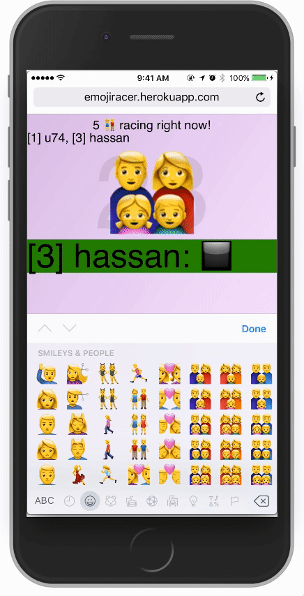
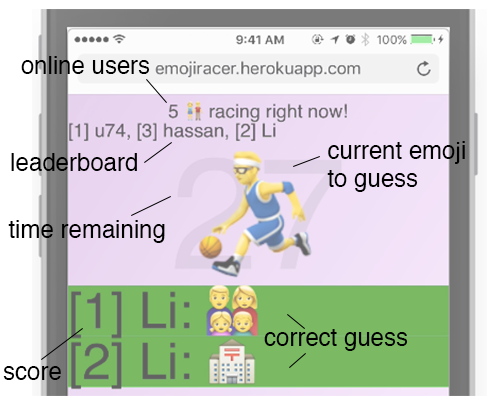

# Emoji Racer

[Live!](https://emojiracer.herokuapp.com/)

## Background

Emoji Racer is an online multiplayer game where users compete on their knowledge of the always-expanding emoji keyboard. A random emoji is selected and users race to be the first person to find it on their keyboard.



## How it works

### Gameboard layout
The biggest challenge implementing this app was designing for mobile. Phone screens already provide limited viewing area, but since this app relies heavily on input, I realized half of the screen would be taken up by the emoji keyboard.

The two biggest pieces of information to be conveyed are the `current emoji to guess` and the `time remaining`.



### Guess history and display
jQuery events are used to show guesses for a set duration before removing them from the user's screen. Correct guesses are displayed on players' screens longer by using a longer time on the `animate` jQuery function.

```javascript
socket.on('guess', function(msg, name){
  $('<li>').text(`${name}: ${msg}`).appendTo('#messages')
    .fadeIn('slow')
    .animate({opacity: 1.0}, 1000)
    .fadeOut('slow');
});
```

### Live player count
Upon receiving a socket connection, the game updates its player count and begins listening for a disconnect. On disconnect, the game deletes the user's score from the session and sends a new scoreboard to the remaining players.

```javascript
io.on('connection', function(socket){
  connections += 1;
  socket.on('disconnect', function(){
    connections -= 1;
    delete ids[clientId]
    io.emit('connections', connections);
    io.emit('online players', onlinePlayers());
  });
});
```

### Cheat prevention
Because emoji are ANSI characters that can be copied and pasted, the game listens for these actions using jQuery events and prevents the user from having an unfair advantage.
```javascript
$('body').bind('copy paste',function(e) {
  socket.emit('cheating', $('#username').val());
  e.preventDefault(); return false;
});
```

## Tech

* **socket.io** - Real-time engine, used to receive a user's guess and broadcast it (whether correct or incorrect) to other connected users

* **jQuery** - JavaScript DOM manipulation library used to listen for

* **node-emoji** - A library to generate random emojis

* **nodemon** - Development module that reloads and restarts the node server when server files are changed. Helpful in speeding up development and testing.
